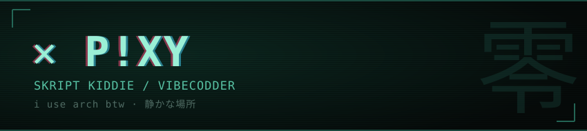

### `whoami`

somewhere between `skript kiddie` and knowing what i'm doing. web apps + active directory, authorized bug bounty on **Standoff 365** and **BI.ZONE**. mostly breaking my own lab and reading HackTricks at 3am.

arch linux · fish · too much coffee.

 

**stack**

 

 

零 · 静かな場所 · ゼロトラスト · 最小権限
